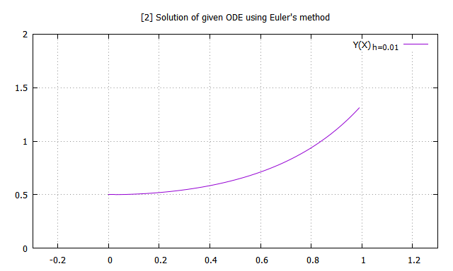
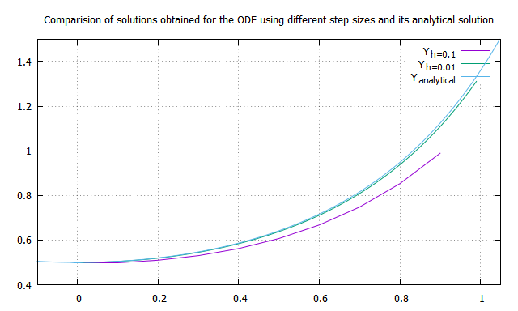

## Euler's method to solve differential equations:

#### Recursion formula for Euler's method 

For a given differential equation along with an initial condition,
\[
\frac{dy}{dx} = f(x,y) \ ; \qquad y(x=x_0) = y_0 \\
\]

we can write the recussion equation as,
\[
y_{i+1} = y_i + h f(x_i, y_i)
\]

where  is the step size or small interval defined as,
\[
    h = x_{i+1} - x_i \quad \text{where} \quad i \ \epsilon \ \mathbb{Z^+} 
\]

##### Example
Given differential equation and corresponding initial condition are 
\[
\frac{dy}{dx} = 2xy \ ; \qquad y(x=0) = 0.5 \\
\]

##### Analytical solution

Rearranging above equation
\[
\frac{dy}{y} \ = \ 2x{dx} \\
\] 
Now, integrating on both sides we get,
\[
\int \frac{dy}{y} \ = \ \int 2x{dx} 
\] 

\[
    \ln{y} \ = \ x^2 + C
\]
Simplifying and using given initial condition, we get,
\[
y(x) \ = \ \frac{1}{2} \exp(x^2) \\
\]

**Note**: The graphical representation of solutions obtained using Euler's method have been restricted to the interval 

