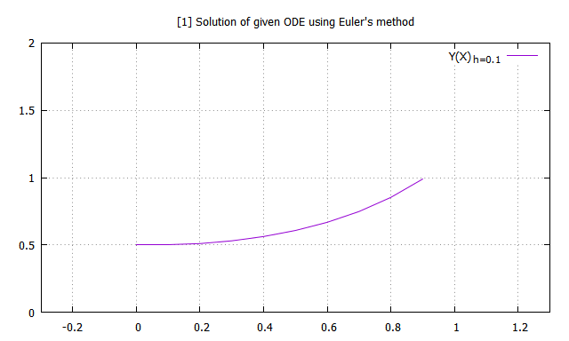

## Euler's method to solve differential equations:

#### Recursion formula for Euler's method 

For a given differential equation along with an initial condition,

we can write the recussion equation as,

where _h_ is the step size or small interval defined as,

#### Example
Given differential equation and corresponding initial condition are 

#### Analytical solution

Rearranging above equation

 
Now, integrating on both sides we get,

 

Simplifying and using given initial condition, we get,

**Note**: The graphical representation of solutions obtained using Euler's method have been restricted to the interval 

