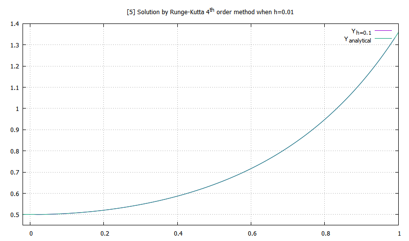
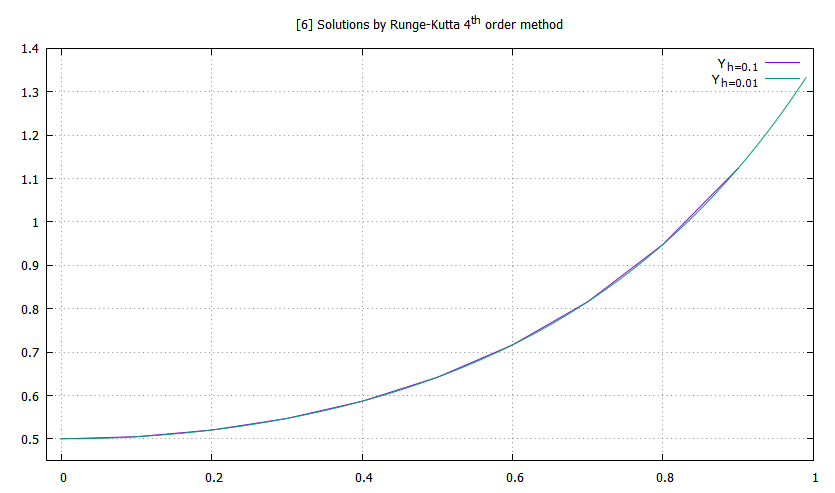
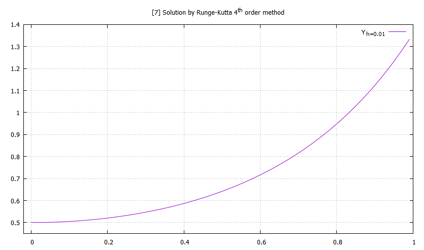

# Runge-Kutta methods to solve differential equations:

## 1. Runge-Kutta 2nd order method (RK2M):
#### Recursion formula for RK2M

For a given differential equation along with an initial condition,
$$
\frac{dy}{dx} = f(x,y) \ ; \qquad y(x=x_0) = y_0 \\
$$

we can write the recursion equation as,
$$
y_{i+1} = y_i + \frac{h}{2} (S_1 + S_2)
$$
where 
$$
S_1 = f(x_i, y_i)  $$ 
$$
S_2  = f(x_i + h, y_i + h f(x_i, y_i))\\
$$
and h is the step size or small interval defined as,
$$
    h = x_{i+1} - x_i \quad \text{where} \quad i \ \epsilon \ \mathbb{Z^+} 
$$

#### Example
Given differential equation and corresponding initial condition are 
$$
\frac{dy}{dx} = 2xy \ ; \qquad y(x=0) = 0.5 \\
$$

Above differential equation has the following solution
$$
y(x) \ = \ \frac{1}{2} \exp(x^2) \\
$$

**Note**: The graphical representation of solutions obtained using RK2M have been restricted to the interval $[0,1]$

---

## 2. Runge-Kutta 4th order method (RK4M):
#### Recursion formula for RK4M

For a given differential equation along with an initial condition,
$$
\frac{dy}{dx} = f(x,y) \ ; \qquad y(x=x_0) = y_0 
$$

we can write the recursion equation as,
$$
y_{i+1} = y_i + \frac{h}{6} (S_1 + 2 S_2 + 2 S_3 + S4)
$$

where 
$$
S_1 = f(x_i, y_i) $$
$$
S_2  = f(x_i + \frac{h}{2}, y_i + \frac{h}{2} S_1)$$
$$
S_3 =  f(x_i + \frac{h}{2}, y_i + \frac{h}{2} S_2) $$
$$
S_4 =  f(x_i + h, y_i + h S_3)
$$

and $h$ is the step size or small interval defined as,
$$
    h = x_{i+1} - x_i \quad \text{where} \quad i \ \epsilon \ \mathbb{Z^+} 
$$

#### Example 
For the same example above, using RK4M we obtain,

**Note**: The graphical representation of solutions obtained using RK4M have been restricted to the interval $[0,1]$

---

###### Data files:
- RK2M
    - For h = 0.1 [here](rkm21.txt)
    - For h = 0.01 [here](rkm22.txt)
- RK4M
    - For h = 0.1 [here](rkm41.txt)
    - For h = 0.01 [here](rkm42.txt)

---

###### Additional note:
The interval $[0,1]$ is quite large to observe the difference between the analytical and the numerical solution. I've kept it that way because though by changing the graph parameters we can see the difference, the graph so obtained will look like a straight line and won't serve any purpose.