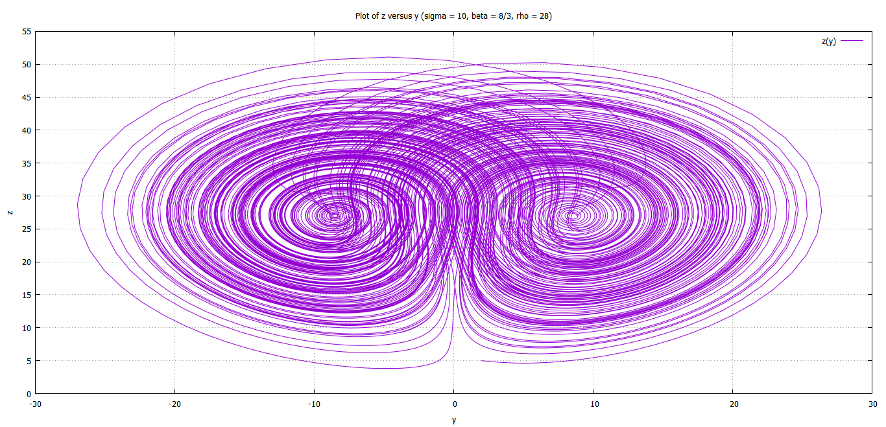
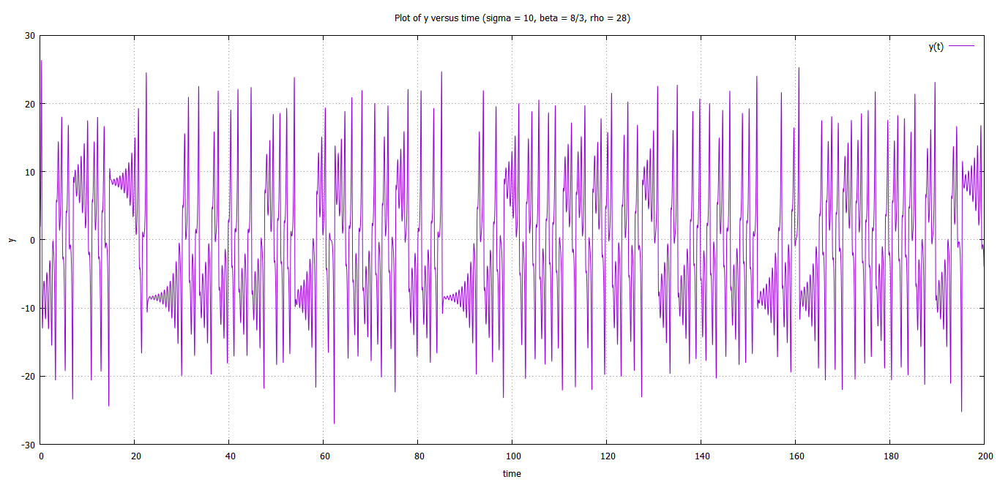

 
# Lorenz Equations

The dynamics of a Lorenz system is described by the following differential equations, 

<!-- $$
\dot{x} \ = \ \sigma (y - x) 
$$ --> 

	
<!-- $$
\dot{y} \ = \ x(\rho - z) - y 
$$ --> 

	
<!-- $$
\dot{z} \ = \ xy - \beta z
$$ --> 

	where <!-- $\sigma, \rho, \beta \ \epsilon \ \mathbb{R}$ --> 

Read more about physical interpretations of these equation on [Wikipedia](https://en.wikipedia.org/wiki/Lorenz_system)

### Numerical Analysis
For <!-- $\sigma = 10, \rho = 28, \beta = 8/3$ --> , we get the following solution, using Euler's method (h=0.01),

Data file for above plots can be found [here](/LSA/plots/leqn1.dat)
Fortran code (using Euler's method)  [source file](/LSA/lorenz1.f95)
Fortran code (using Runge-Kutta 4th order method)  [source file](/LSA/lorenz2.f95)

### Scripts and Plots
Plots and Gnuplot scripts can be found [*here*](/LSA/plots)

A thorough analysis of these equations can be read [*here*](Lorenz_analysis.pdf)

All the plots for above analysis are compiled [*here*](Lorenz_plots.pdf)

