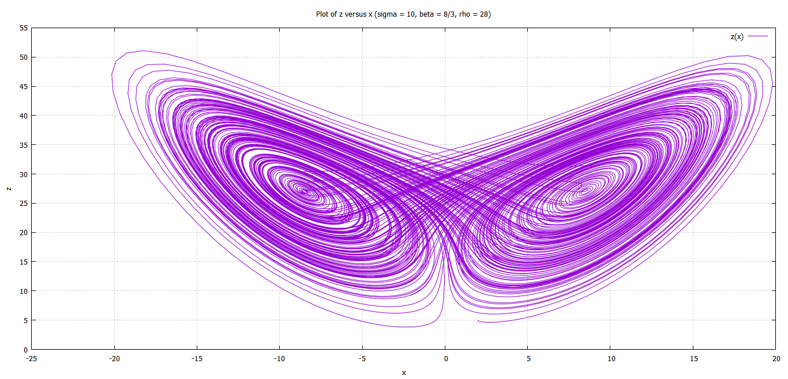

 
# Lorenz Equations

The dynamics of a Lorenz system is described by the following differential equations, 

$$
\dot{x} \ = \ \sigma (y - x) 
$$
	
$$
\dot{y} \ = \ x(\rho - z) - y 
$$
	
$$
\dot{z} \ = \ xy - \beta z
$$
	where $\sigma, \rho, \beta \ \epsilon \ \mathbb{R}$

Read more about physical interpretations of these equation on [Wikipedia](https://en.wikipedia.org/wiki/Lorenz_system)

## Summary 
Following results are true assuming $\sigma, \beta > 0$

- **Fixed points**:
$$ 
				\begin{aligned}
				P_1 \ &\equiv \ (0,0,0) \\
				P_2 \ &\equiv \ (\sqrt{\beta(\rho-1)}, \sqrt{\beta(\rho-1)}, \rho - 1) \\
				P_3 \ &\equiv \ (- \sqrt{\beta(\rho-1)}, - \sqrt{\beta(\rho-1)}, \rho -1)
				\end{aligned}			
$$
		
- **Eigenvalue equations**:
$$
			\begin{aligned}
				P_1:& \qquad (\beta+\lambda)[\lambda^2 + (1+\sigma)\lambda - \sigma(\rho-1)] = 0\\
				P_2, P_3:& \qquad \lambda^3 + (1+\sigma+\beta)\lambda^2 + \beta(\sigma + \rho)\lambda + 2\sigma \beta (\rho -1) &= 0
			\end{aligned}	
$$
		
- **Jacobian matrices**:
$$
			\begin{aligned}
				J(P_1) &= \begin{bmatrix}
					- \sigma &  \sigma & 0 \\
					\rho  &  - 1 & 0 \\
					0 & 0 & - \beta 
				\end{bmatrix}	\\
				J(P_2) &= \begin{bmatrix}
					- \sigma &  \sigma & 0 \\
					1 &  - 1 & - \sqrt{\beta(\rho-1)} \\
					\sqrt{\beta(\rho-1)} & \sqrt{\beta(\rho-1)} & - \beta 
				\end{bmatrix} \\
				J(P_3) &= \begin{bmatrix}
					- \sigma &  \sigma & 0 \\
					1 &  - 1 &  \sqrt{\beta(\rho-1)} \\
					-\sqrt{\beta(\rho-1)} & -\sqrt{\beta(\rho-1)} & - \beta 
				\end{bmatrix}
			\end{aligned}	
$$
		
- **Stability of $P_1$**:
$$
			\begin{aligned}
				\text{stable fixed point if},& \quad 0 < \rho < 1 \\
				\text{unstable fixed point if},& \quad  \rho > 1 \ \ \text{or} \ \ \rho < 0 \\
			\end{aligned}
$$
		
- **Stability of $P_2$ and $P_3$**:
$$
			\begin{aligned}
				\text{stable fixed points if},& \quad 1 < \rho < \rho_0 \ \ \text{and} \ \ \sigma > \beta+1 \\
				\text{unstable fixed points if},& \quad  \rho > \rho_0  \ \text{or} \ \ \rho < 1 \ \text{or} \ \ \sigma < \beta+1
			\end{aligned}
$$

## Numerical Analysis
For $\sigma = 10, \rho = 28, \beta = 8/3$, we get the following solution, using Euler's method (h=0.01),

Data file for above plots can be found [here]()

### Scripts and Plots
Plots and Gnuplot scripts can be found [*here*](/LSA/plots)

A thorough analysis (without Bifurcation analysis) can be found [*here*](Lorenz_analysis.pdf)

All the plots for above analysis are compiled [*here*](Lorenz_plots.pdf)

